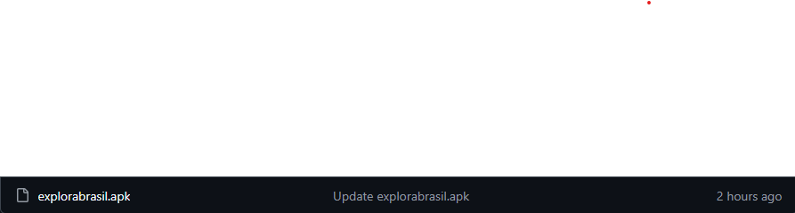

# 🌎 ExploraBrasil - English

---

## 📱 About ExploraBrasil

**ExploraBrasil** is an educational and interactive application developed as part of the **Integrative Project** of the **SESI** and **SENAI** institutions in Ourinhos (SP). Designed to provide a dynamic learning experience, the app is exclusive to **Android** devices and combines technology with education to explore Brazil's rich cultural and geographical heritage. 🇧🇷

---

## 🛠 Technologies Used

Built with modern tools to ensure a smooth and engaging experience:

- **Languages**: HTML, CSS, TypeScript  
- **Frameworks**: Ionic, Angular  
- **Tools**: Chart.js, GEMINI_API, Image Map Generator  

---

## 🚀 How to Install the Application

Follow the steps below to install **ExploraBrasil** on your Android device:

### 1️⃣ Step 1
- Click on the `explorabrasil.apk` file.  
  

### 2️⃣ Step 2
- After clicking, tap the **three dots** in the top right corner and select **Download**.  
  

---

## 📸 Demonstration

Discover the main features of **ExploraBrasil** through the app's screens:

| **Home Screen** | **Quiz** | **GuIA** | **About** |
|:---------------:|:--------:|:--------:|:---------:|
|  |  |  |  |

---

## 👥 Team Behind the Project

**ExploraBrasil** is the result of the collaborative work of a talented and dedicated team of students and teachers from SESI and SENAI in Ourinhos.

### 🔍 Research Team

#### 📘 Class A
- Ana Júlia Martins da Silva  
- Ana Livia Domingas de Oliveira  
- André Santos Conte  
- Caio Mazini Viana  
- Diego Santiago da Silva  
- Gabriel Silveira Mariano de Souza  
- Guilherme Ferreira Matias de Oliveira  
- Gustavo Bonifácio Ferreira  
- Igor Schanoski Pedro da Silva  
- Kauany Gabrieli Ribeiro Cavatoni  
- Laís Elias da Silva  
- Leandro de Oliveira Sibim  
- Lívia Araujo Berlandi  
- Maria Clara Milhorança Verri  
- Maria Eduarda Abreu Benedito  
- Maria Eduarda Da Silva  
- Maria Eduarda de Andrade Soares  
- Matheus Guerra Brisola Cardoso  
- Murilo Mesquita Molina  
- Nicole dos Santos Moreira  
- Nicoli de Camargo Miranda Farias  
- Pedro Henrique Moreira Redondo  
- Renan Cadamuro Carrara  
- Vinicius Feliciano Barbosa  

#### 📗 Class B
- Ana Luiza Mello de Oliveira  
- Ana Luiza Vieira Pazinato  
- Caique da Silva Campos  
- Carlos Daniel Veigas Silva  
- Eliza Praxedes Branco  
- Gabriel Depizol Brito  
- Gabriel Silverio de Oliveira  
- Giovana Gabrielly Mazetto de Oliveira  
- Giulia Barboza Venerando  
- Giulianna Tavares de Moraes  
- Guilherme Delfino de Souza  
- Guilherme Olmo de Freitas  
- Gustavo Rocha Pereira  
- Isabela Antunes de Lira  
- Isadora de Castro Mussi Beffa  
- João Vitor Gerim Damiani  
- Juliana de Almeida Nogueira  
- Kauã Bachiega Graciano  
- Kauany Cristina de Assis Santos  
- Kayky Gabriel Corrêa Vici  
- Lavínia Cristina Burato  
- Leticia Nunes Gotardi  
- Lorena Viganó  
- Lucas Miranda de Souza  
- Manuela Alves Felix  
- Maria Clara Benato Gama  
- Matheus Batista Stopa  
- Nathalye Mendes Cardoso dos Reis  
- Samuel dos Santos Luqueto  
- Sarah Leocadio Antunes Martins  
- Thariany dos Santos  
- Yasmim Domingues da Silva  

### 💻 Development Team
- Ana Lívia Evangelista da Silva  
- Arthur Vida Leal  
- Beatriz Cazula Mantovani  
- Carlos Eduardo Alexandrino  
- Gabriel Marcelo Lopes da Fonseca  
- João Pedro Dala Dea Mello  
- Lívia Stolses Marrera  

### 👨‍🏫 Mentors
- **João Paulo de Oliveira** — SENAI Ourinhos Instructor  
- **Mateus Henrique Vanderlei da Paixão** — SESI Ourinhos Geography Teacher  

---

## 🌟 Join the Journey!

Download **ExploraBrasil** and dive into a unique educational experience! Explore, learn, and have fun discovering Brazil interactively. 📲

---

# 🌎 ExploraBrasil - Português(BR)

---

## 📱 Sobre o ExploraBrasil

O **ExploraBrasil** é um aplicativo educativo e interativo desenvolvido no âmbito do **Projeto Integrador** das instituições **SESI** e **SENAI** de Ourinhos (SP). Criado para proporcionar uma experiência de aprendizado dinâmica, o app é exclusivo para dispositivos **Android** e combina tecnologia com educação para explorar a riqueza cultural e geográfica do Brasil. 🇧🇷

---

## 🛠 Tecnologias Utilizadas

Desenvolvido com ferramentas modernas para garantir uma experiência fluida e envolvente:

- **Linguagens**: HTML, CSS, TypeScript  
- **Frameworks**: Ionic, Angular  
- **Ferramentas**: Chart.js, GEMINI_API, Image Map Generator  

---

## 🚀 Como Instalar o Aplicativo

Siga os passos abaixo para instalar o **ExploraBrasil** no seu dispositivo Android:

### 1️⃣ Etapa 1
- Clique no arquivo `explorabrasil.apk`.  
  

### 2️⃣ Etapa 2
- Após clicar, toque nos **três pontos** no canto superior direito e selecione **Download**.  
  

---

## 📸 Demonstração

Conheça as principais funcionalidades do **ExploraBrasil** através das telas do aplicativo:

| **Tela Inicial** | **Quiz** | **GuIA** | **Sobre** |
|:-----------------:|:--------:|:--------:|:--------:|
|  |  |  |  |

---

## 👥 Equipe por Trás do Projeto

O **ExploraBrasil** é o resultado do trabalho colaborativo de uma equipe talentosa e dedicada, composta por alunos e professores do SESI e SENAI de Ourinhos.

### 🔍 Equipe de Pesquisa

#### 📘 Turma A
- Ana Júlia Martins da Silva  
- Ana Livia Domingas de Oliveira  
- André Santos Conte  
- Caio Mazini Viana  
- Diego Santiago da Silva  
- Gabriel Silveira Mariano de Souza  
- Guilherme Ferreira Matias de Oliveira  
- Gustavo Bonifácio Ferreira  
- Igor Schanoski Pedro da Silva  
- Kauany Gabrieli Ribeiro Cavatoni  
- Laís Elias da Silva  
- Leandro de Oliveira Sibim  
- Lívia Araujo Berlandi  
- Maria Clara Milhorança Verri  
- Maria Eduarda Abreu Benedito  
- Maria Eduarda Da Silva  
- Maria Eduarda de Andrade Soares  
- Matheus Guerra Brisola Cardoso  
- Murilo Mesquita Molina  
- Nicole dos Santos Moreira  
- Nicoli de Camargo Miranda Farias  
- Pedro Henrique Moreira Redondo  
- Renan Cadamuro Carrara  
- Vinicius Feliciano Barbosa  

#### 📗 Turma B
- Ana Luiza Mello de Oliveira  
- Ana Luiza Vieira Pazinato  
- Caique da Silva Campos  
- Carlos Daniel Veigas Silva  
- Eliza Praxedes Branco  
- Gabriel Depizol Brito  
- Gabriel Silverio de Oliveira  
- Giovana Gabrielly Mazetto de Oliveira  
- Giulia Barboza Venerando  
- Giulianna Tavares de Moraes  
- Guilherme Delfino de Souza  
- Guilherme Olmo de Freitas  
- Gustavo Rocha Pereira  
- Isabela Antunes de Lira  
- Isadora de Castro Mussi Beffa  
- João Vitor Gerim Damiani  
- Juliana de Almeida Nogueira  
- Kauã Bachiega Graciano  
- Kauany Cristina de Assis Santos  
- Kayky Gabriel Corrêa Vici  
- Lavínia Cristina Burato  
- Leticia Nunes Gotardi  
- Lorena Viganó  
- Lucas Miranda de Souza  
- Manuela Alves Felix  
- Maria Clara Benato Gama  
- Matheus Batista Stopa  
- Nathalye Mendes Cardoso dos Reis  
- Samuel dos Santos Luqueto  
- Sarah Leocadio Antunes Martins  
- Thariany dos Santos  
- Yasmim Domingues da Silva  

### 💻 Equipe de Desenvolvimento
- Ana Lívia Evangelista da Silva  
- Arthur Vida Leal  
- Beatriz Cazula Mantovani  
- Carlos Eduardo Alexandrino  
- Gabriel Marcelo Lopes da Fonseca  
- João Pedro Dala Dea Mello  
- Lívia Stolses Marrera  

### 👨‍🏫 Orientadores
- **João Paulo de Oliveira** — Instrutor do SENAI Ourinhos  
- **Mateus Henrique Vanderlei da Paixão** — Professor de Geografia do SESI Ourinhos  

---

## 🌟 Junte-se à Jornada!

Baixe o **ExploraBrasil** e aproveite em uma experiência educativa única! Explore, aprenda e divirta-se descobrindo o Brasil de forma interativa. 📲