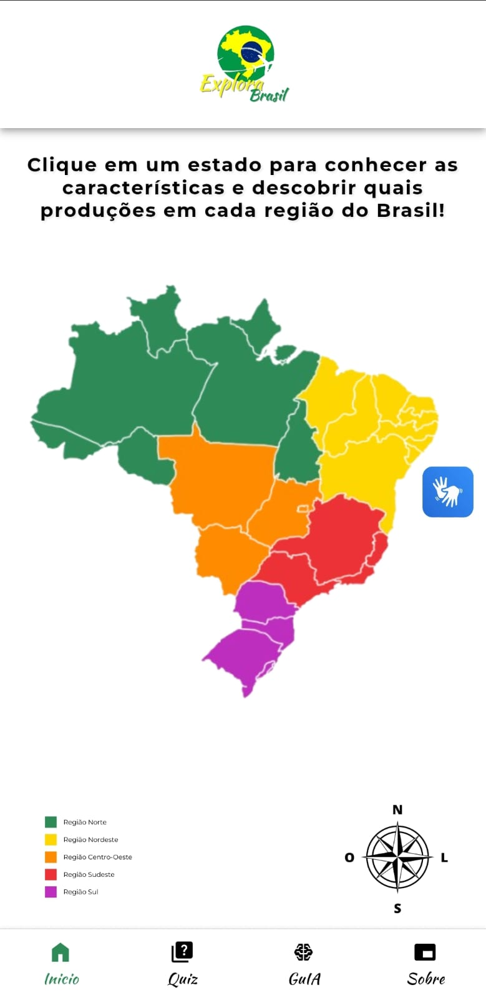
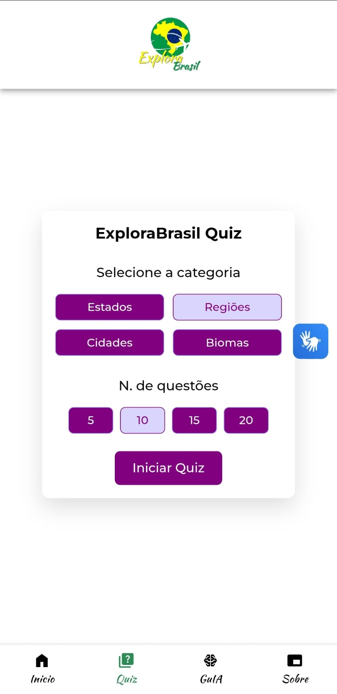
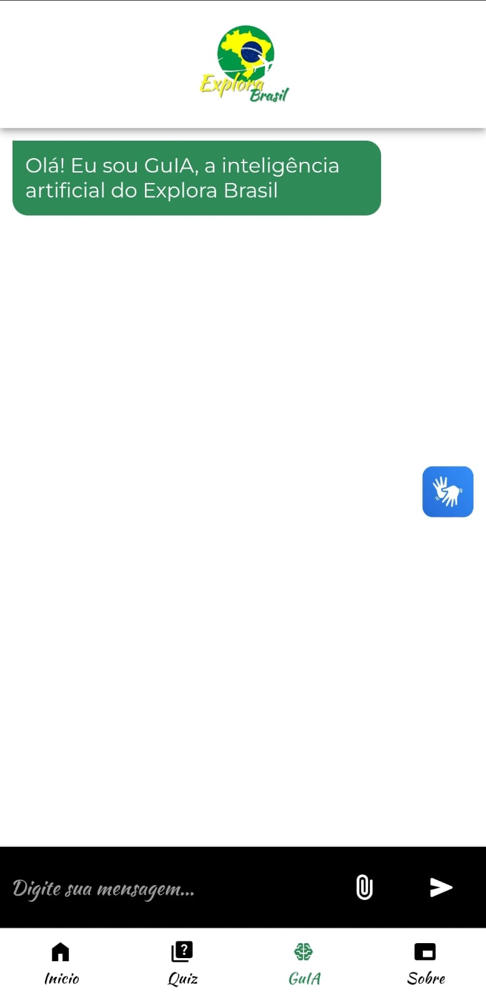
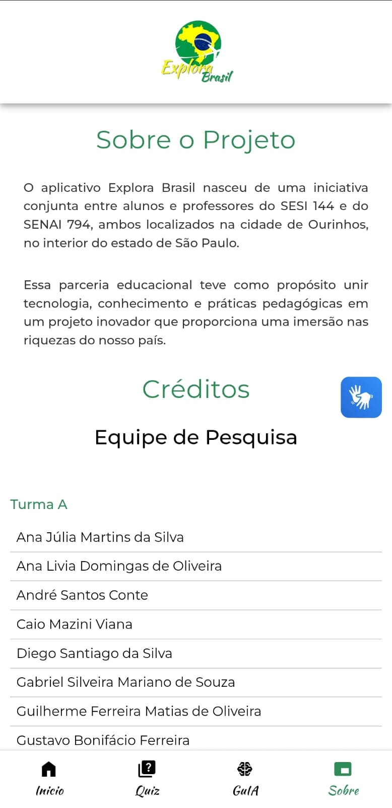

# ExploraBrasil

## Sobre o aplicativo

Aplicativo criado no âmbito do Projeto Integrador das instituições SESI e SENAI de Ourinhos (SP), voltado para oferecer uma experiência educativa e interativa. Disponível exclusivamente para dispositivos Android.

## Tecnologias utilizadas

- Linguagens: HTML, CSS, TypeScript  
- Frameworks: Ionic, Angular  
- Outras ferramentas: Chart.js, GEMINI_API, Image Map Generator

## Demonstração / Screenshots

Tela inicial do ExploraBrasil  

Quiz  

GuIA

Sobre o projeto
